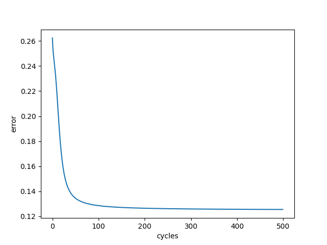
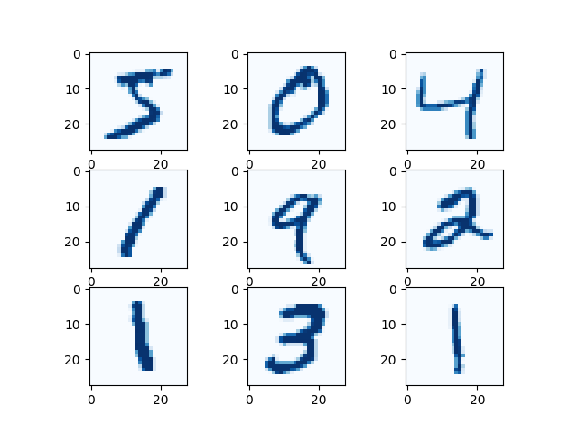
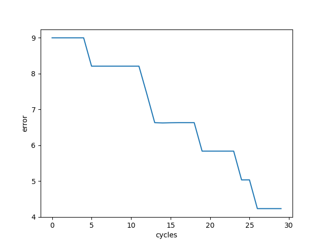

# hand_written_digits

This is my project to recognise hand written digits through use of a neural network. The network class is written without the help of any explicit machine learning libaries and uses batch gradient descent.
The numpy package was used to manage all the linear algebra involved with both training and propogating an input through a network.

After implementing my class for a neural network, to test my program worked correctly I began by training a net to approximate the XOR binary function. 
I carried out 50000 training cycles, calculating the error in my network every 100 cycles using the MSE cost function. I was able to produce the following graph:

Showing my network to be accurate to over 99.88%.

Knowing my program to be correct in function, I trained a net to recognise 28 * 28 bitmap pixel images of hand drawn digits from the MNIST dataset. A sample of digits from the dataset:

With batches of 10 items and 30 training iterations, the net's progress through training can be seen through the graph:

Meaning it was able to achieve an accuracy greater than 96%.
